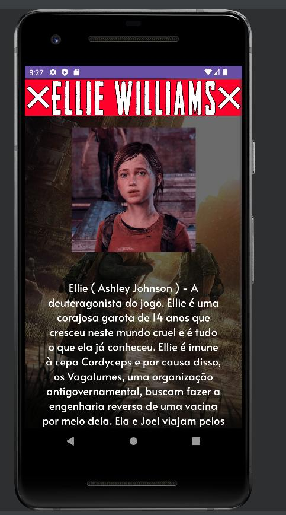
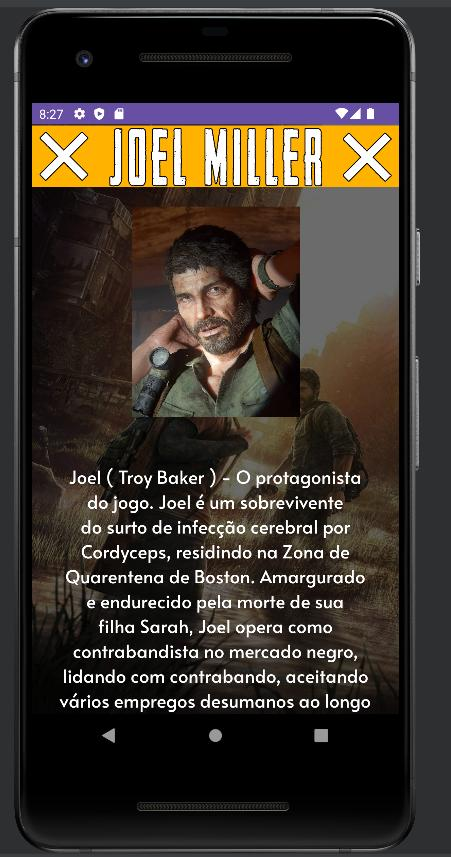
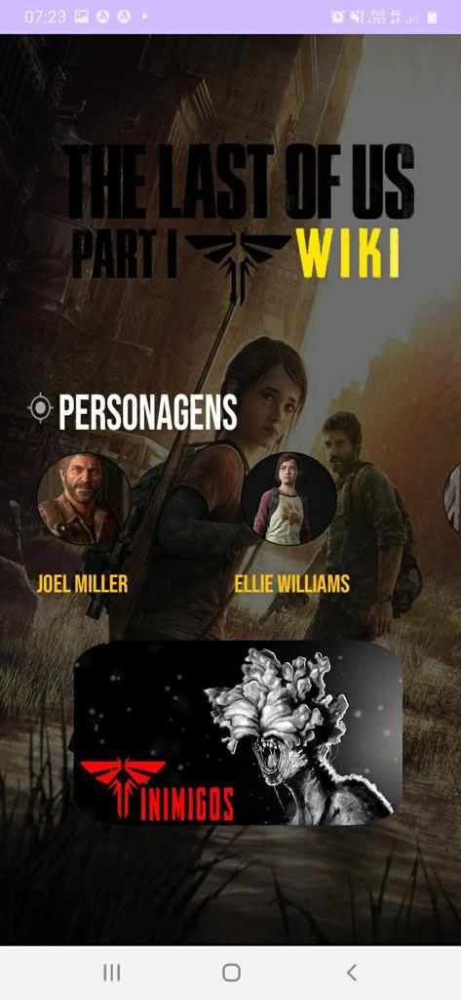
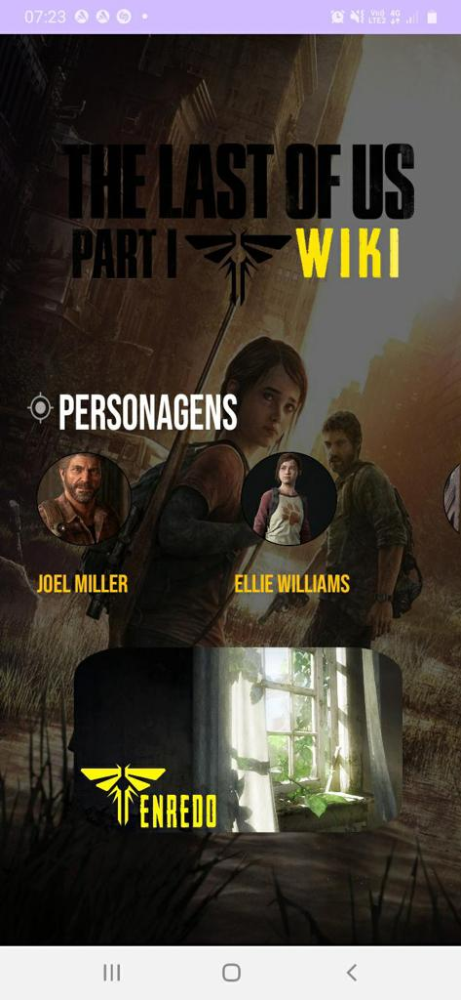
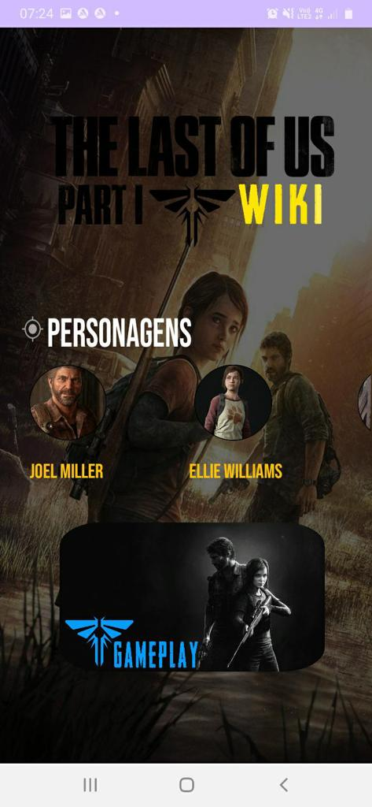
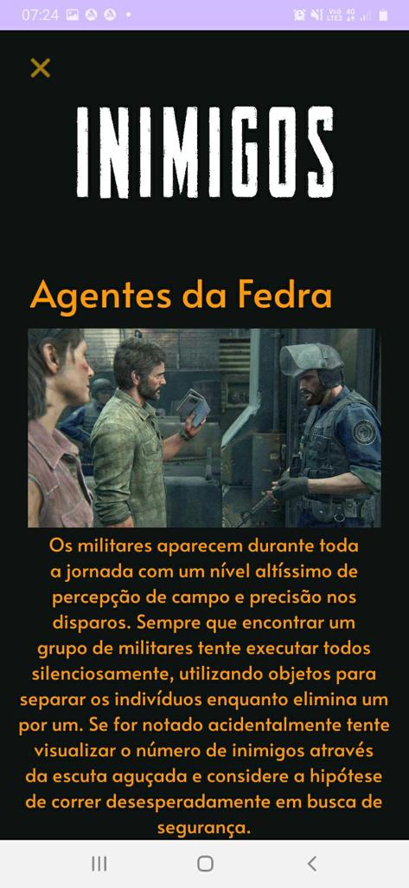
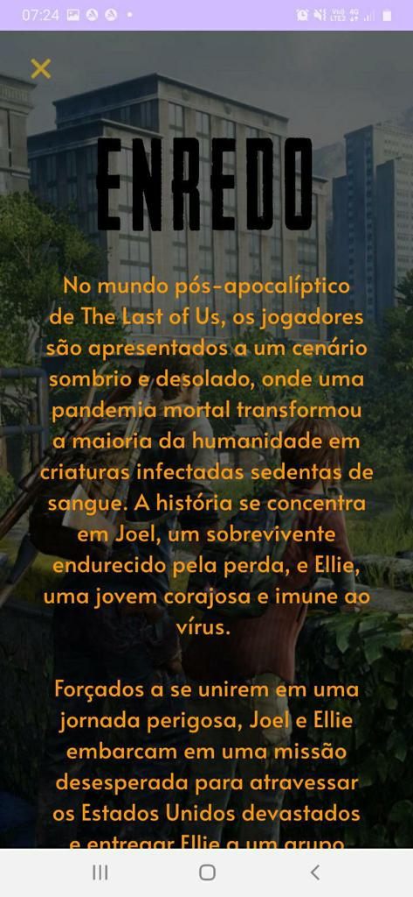
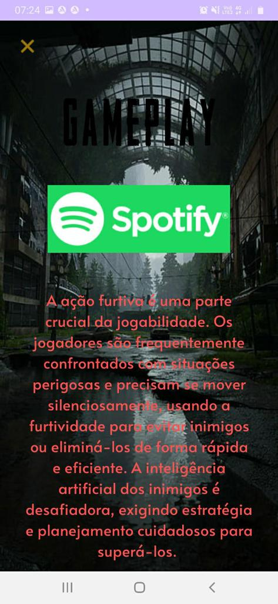

# TheLastOfUsWIKI - Atividade de PDM
## Iago Carvalho e André Vitor Pimentel 📖

Em nosso projeto foi realizada a criação de um aplicativo simples baseado no jogo para console "The Last Of Us (Part 1)",
cumprindo com os requisitos necessários na inserção de Activities, Views e Intents explícitas e implicitas, sendo assim,
foi criado uma wiki contendo as informações principais do jogo.  

 ### Link do vídeo: https://www.youtube.com/watch?v=6XyvmuV8s30

  

## Navegação 🧭
### Personagens

A main Activy do aplicativo é a tela de menu, ela é a primeira tela do aplicativo e é responsável apenas por exibir as views de 
buttons que irão o direcionar para outras telas, de acordo com o conteúdo específico. Após o título da aplicação, é apresentado o setor de personagens, cada personagem apresentado nos ícones é uma view diferente que irá
levar o usuário a outra tela apenas com as informações do personagem em específico. 
 
 

   
   

   
### Menu

Ao voltar ao menu, abaixo da tela do setor dos personagens há três buttons diferentes, cada uma correspondendo a uma informação do jogo
primeiramente temos os inimigos, e com o uso da scrollview são apresentados abaixo os buttons para as informações de gameplay e enredo.   

  
  
  

  

### Inimigos

Ao clicar no button inimigos o usuário é direcionado a activity contendo as informações sobre os adversário do jogo:

  

 

### Enredo

No button enredo, mostrado no menu, abre uma activity com as informações sobre a história do jogo, scrollando ao final da tela, há um link em formato de icone que permite que o usuário acesse uma página na amazon para a compra do jogo:

  

### Gameplay

 
O último button no final da main activity abre uma tela com as informações sobre a gameplay do jogo, antes do texto, há um ícone do spotify que ao clicar leva o usuário a uma playlist do jogo no aplicativo do spotify:

  

